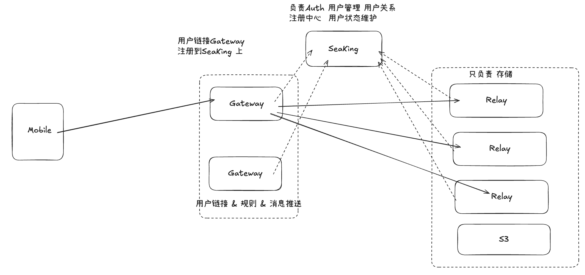

# Nostr-inspired 中心化 IM 技术架构设计文档



## 1. 设计背景与目标

本系统是一套 **参考 Nostr 协议思想（Event / Relay / Client 解耦）**，但面向**工程落地与中心化运营**的即时通讯（IM）架构。

设计目标：

* 保留 Nostr 的 **事件模型（Event）** 与 **Relay 轻逻辑存储** 优点
* 提供中心化 IM 必需的 **账号、关系、权限、推送、风控** 能力
* 支持 **单聊 / 群聊 / 文件 / 回信 / 撤销** 等完整 IM 功能
* 协议层轻量（MsgPack）、可版本化、强扩展
---

## 2. 总体架构概览

系统由五类核心组件构成：

1. **Client（Mobile/Web）**：

   * 用户界面
   * 协议编解码（MsgPack）
   * 本地状态（会话、消息）

2. **Gateway 集群**（连接与推送层）：

   * 统一客户端入口
   * WebSocket 长连接管理
   * 鉴权、协议适配、消息路由与推送

3. **SeaKing（用户与关系中心）**：

   * Auth / 注册 / 登录
   * 用户管理
   * 用户关系（好友、群成员、角色）
   * 用户状态维护
   * 系统“真相源”（Source of Truth）

4. **Relay 集群（事件存储层）**：

   * 只负责事件存储与查询
   * 不理解业务语义
   * 可横向扩展

5. **对象存储（S3/OSS/COS）**：

   * 文件、图片、语音等大对象存储

---

## 3. 核心设计原则

### 3.1 职责严格拆分

| 模块      | 主要职责       | 不承担职责   |
| ------- | ---------- | ------- |
| Client  | UI、编解码、加解密 | 权限判断、存储 |
| Gateway | 连接、路由、推送   | 用户关系真相  |
| SeaKing | 用户/关系/权限   | 消息推送    |
| Relay   | 事件存储       | 业务逻辑    |
| S3      | 文件存储       | 消息索引    |

### 3.2 Relay 轻逻辑原则（Nostr 精神）

Relay 被设计为：

* **哑存储（Dumb Store）**
* 只理解 Event 的最小字段（cid / mid / kind / tags / payload）
* 不主动调用 SeaKing
* 不维护会话、成员、权限

---

## 4. 消息与事件模型

### 4.1 Event 总体模型

所有消息、控制行为都抽象为 **Event**。

Event 是系统中唯一的“消息原子”。

### 4.2 协议封装（Envelope）

所有网络消息使用 MsgPack Map 封装：

```
{
  0: v,        // 协议版本
  1: cmd,      // 命令类型
  2: seq,      // 客户端序列号
  3: sid,      // 会话ID（可选）
  4: body,     // 负载
  15: ext      // 扩展字段（可选）
}
```

### 4.3 Event Body 结构

```
body = {
  0: ev_v,     // 事件版本
  1: cid,      // 会话ID（单聊/群聊）
  2: k,        // kind（事件类型）
  3: mid,      // 消息ID（服务端生成）
  4: t,        // 时间戳（秒）
  5: flg,      // flags 位图
  6: tags,     // 关联标签
  7: data,     // 结构化消息体
  8: sig,      // 可选签名
  15: ext      // 扩展字段
}
```

---

## 5. 消息类型（Kinds）

| Kind | 含义         | 是否持久化 | 说明 |
| ---- | ---------- | -------- | ---- |
| 1    | 文本消息       | ✅ | 基础消息类型 |
| 3    | 文件消息（引用文件） | ✅ | 图片/语音/文件 |
| 5    | 撤销消息       | ✅ | 软删除 |
| 7    | 编辑消息       | ✅ | 编辑已发送消息 |
| 10   | 已读回执       | ✅ | 可聚合存储 |
| 11   | 正在输入       | ❌ | 仅转发不存储 |
| 12   | 消息反应       | ✅ | Reaction/表情回应 |
| 13   | 转发消息       | ✅ | 单条/合并转发 |

### 5.1 文本消息（Kind=1）

```
data = {
  0: "hello world"
}
```

### 5.2 文件消息（Kind=3）

```
data = {
  0: fid,        // 文件ID
  1: name,       // 文件名
  2: size,       // 文件大小
  3: mime,       // MIME
  4: sha256,     // 哈希
  5: url         // 下载地址
}
```

---

## 6. 回信（Reply）设计

### 6.1 Reply 的建模方式

* Reply 不引入新 kind
* 使用 **tags** 建立引用关系

### 6.2 Reply Tag 定义

```
[1, mid]   // reply_to
```

### 6.3 示例

```
tags = [ [1, 9000123] ]
data = { 0: "收到" }
```

---

## 7. 撤销消息（Revoke）设计

### 7.1 撤销模型

* 撤销是一个新的 Event
* 不物理删除原消息

### 7.2 Revoke Kind

| Kind | 含义   |
| ---- | ---- |
| 5    | 撤销消息 |

### 7.3 Revoke Tag

```
[6, mid]   // revoke_target
```

### 7.4 Revoke Data

```
data = {
  0: scope,     // 1=全体可见, 2=仅自己
  1: reason     // 撤销原因（可选）
}
```

### 7.5 服务端校验规则

* 目标消息必须存在且属于同 cid
* 单聊：只能撤销自己发送的消息
* 群聊：

  * 普通用户：撤销自己消息
  * 管理员：可撤销他人消息
* 可配置时间窗口（如 2 分钟）

---

## 8. 编辑消息（Edit）设计

### 8.1 编辑模型

* 编辑是一个新的 Event（Kind=7）
* 不覆盖原消息，保留编辑历史
* 客户端展示最新版本，可查看历史

### 8.2 Edit Kind

| Kind | 含义   |
| ---- | ---- |
| 7    | 编辑消息 |

### 8.3 Edit Tag

```
[6, mid]   // edit_target（指向被编辑的原消息）
```

### 8.4 Edit Data

```
data = {
  0: "新的消息内容",     // 编辑后的内容
  1: edit_version       // 编辑版本号（从1开始递增）
}
```

### 8.5 服务端校验规则

* 目标消息必须存在且属于同 cid
* 只能编辑自己发送的消息
* 只能编辑 Kind=1（文本消息）
* 可配置时间窗口（如 24 小时内可编辑）
* edit_version 必须递增

### 8.6 示例

```
// 原消息 mid=9000123
{ k: 1, data: { 0: "hello" } }

// 编辑事件
{
  k: 7,
  tags: [ [6, 9000123] ],
  data: { 0: "hello world", 1: 1 }
}
```

---

## 9. 已读回执（Read Receipt）设计

### 9.1 已读模型

* 已读回执是 Event（Kind=10）
* 采用"水位线"模式：只发已读到的最后一条消息ID
* 之前的消息都视为已读

### 9.2 Read Receipt Kind

| Kind | 含义   |
| ---- | ---- |
| 10   | 已读回执 |

### 9.3 Read Receipt Data

```
data = {
  0: last_read_mid    // 已读到的最后一条消息ID
}
```

### 9.4 存储策略

* 同一 cid + uid 下多条回执只保留最新
* 群聊场景：按 uid 存储各自的已读位置
* 可聚合压缩存储

### 9.5 示例

```
{
  k: 10,
  cid: "123",
  data: { 0: 9000456 }   // 已读到消息ID 9000456
}
```

---

## 10. 正在输入（Typing Indicator）设计

### 10.1 Typing 模型

* Typing 是 Event（Kind=11）
* **不持久化**：Gateway 直接转发，不写 Relay
* 用于实时显示对方输入状态

### 10.2 Typing Kind

| Kind | 含义   |
| ---- | ---- |
| 11   | 正在输入 |

### 10.3 Typing Data

```
data = {
  0: state    // 1=开始输入, 0=停止输入
}
```

### 10.4 客户端行为

* 开始输入时发送 state=1
* 停止输入或发送消息后发送 state=0
* 超时机制：5秒无新输入自动发 state=0
* 接收端：收到 state=1 后显示"对方正在输入..."，超时或收到 state=0 后隐藏

### 10.5 群聊策略

* 大群（如 >100人）可关闭此功能以减少流量
* 或只显示"N人正在输入"

---

## 11. 消息反应（Reaction）设计

### 11.1 Reaction 模型

* Reaction 是 Event（Kind=12）
* 支持 emoji 表情回应
* 同一用户可对同一消息发多个不同 emoji

### 11.2 Reaction Kind

| Kind | 含义   |
| ---- | ---- |
| 12   | 消息反应 |

### 11.3 Reaction Tag

```
[6, mid]   // reaction_target（指向目标消息）
```

### 11.4 Reaction Data

```
data = {
  0: emoji,     // 表情符号，如 "👍" "❤️" "😂"
  1: action     // 1=添加, 0=取消
}
```

### 11.5 客户端展示

* 聚合展示：`👍 3  ❤️ 5`
* 点击可查看具体是谁反应的
* 再次点击同一 emoji 发送 action=0 取消

### 11.6 示例

```
// 给消息 9000123 点赞
{
  k: 12,
  tags: [ [6, 9000123] ],
  data: { 0: "👍", 1: 1 }
}

// 取消点赞
{
  k: 12,
  tags: [ [6, 9000123] ],
  data: { 0: "👍", 1: 0 }
}
```

---

## 12. 消息转发（Forward）设计

### 12.1 Forward 模型

* 转发是 Event（Kind=13）
* 支持单条转发和合并转发
* 保留原消息来源信息

### 12.2 Forward Kind

| Kind | 含义   |
| ---- | ---- |
| 13   | 转发消息 |

### 12.3 Forward Tags

```
[8, source_cid]    // 原会话ID
[9, source_mid]    // 原消息ID（单条转发时）
```

### 12.4 Forward Data

```
data = {
  0: forward_type,    // 1=单条转发, 2=合并转发
  1: snapshot         // 消息快照（防止原消息被删）
}
```

### 12.5 单条转发示例

```
{
  k: 13,
  cid: "target_cid",
  tags: [ [8, "source_cid"], [9, 9000123] ],
  data: {
    0: 1,
    1: { k: 1, data: { 0: "原消息内容" }, sender: "user123", t: 1700000000 }
  }
}
```

### 12.6 合并转发示例

```
{
  k: 13,
  cid: "target_cid",
  tags: [ [8, "source_cid"] ],
  data: {
    0: 2,
    1: [
      { k: 1, data: { 0: "消息1" }, sender: "user1", t: 1700000001 },
      { k: 1, data: { 0: "消息2" }, sender: "user2", t: 1700000002 },
      { k: 3, data: { 0: "fid", 1: "image.png", ... }, sender: "user1", t: 1700000003 }
    ]
  }
}
```

### 12.7 权限校验

* 不能转发私密会话内容（服务端检查来源会话权限）

---

## 13. @提及（Mention）设计

### 13.1 Mention 模型

* @提及 **不引入新 Kind**
* 通过 **tags** 扩展实现
* 可用于任何消息类型（Kind=1, 3 等）

### 13.2 Mention Tag

```
[2, uid]      // @某个用户
[2, "all"]    // @全体成员（特殊值）
```

### 13.3 示例

```
{
  k: 1,
  cid: "group_123",
  tags: [
    [2, "user_001"],
    [2, "user_002"]
  ],
  data: { 0: "hello @张三 @李四 请查看附件" }
}

// @全体成员
{
  k: 1,
  cid: "group_123",
  tags: [ [2, "all"] ],
  data: { 0: "@所有人 明天开会" }
}
```

### 13.4 服务端行为

* 被@的用户推送优先级提升
* @all 需要权限控制（管理员/群主）
* 可用于未读消息的特殊标记

---

## 14. 消息搜索（Search）协议

### 14.1 搜索模型

* 搜索是 **请求/响应协议**，不是 Event
* Relay 需建立全文索引（推荐 ES/MeiliSearch）

### 14.2 搜索请求

```
{
  cmd: "search",
  body: {
    cid: "123",              // 可选：限定会话
    q: "关键词",              // 搜索词
    kinds: [1],              // 可选：限定消息类型
    before: 1700000000,      // 可选：时间范围上限
    after: 1699000000,       // 可选：时间范围下限
    limit: 20,               // 返回条数
    offset: 0                // 偏移量（分页）
  }
}
```

### 14.3 搜索响应

```
{
  cmd: "search_result",
  body: {
    total: 156,              // 总匹配数
    items: [
      {
        mid: 9000123,
        cid: "123",
        k: 1,
        data: { 0: "包含关键词的消息" },
        t: 1700000000,
        highlight: "...包含<em>关键词</em>的消息..."
      }
    ]
  }
}
```

### 14.4 权限控制

* 只能搜索自己参与的会话
* Gateway 需校验用户对 cid 的访问权限

---

## 15. Tags 汇总表

| Tag类型 | 格式 | 用途 | 使用场景 |
| ------- | ---- | ---- | -------- |
| 1 | `[1, mid]` | 回复引用 | 回复消息 |
| 2 | `[2, uid]` | @提及 | 文本消息中@某人 |
| 6 | `[6, mid]` | 目标消息引用 | 撤销/编辑/Reaction |
| 8 | `[8, cid]` | 转发来源会话 | 消息转发 |
| 9 | `[9, mid]` | 转发来源消息 | 单条转发 |

---

## 16. Gateway 设计说明

Gateway 负责：

* WebSocket 连接管理
* 鉴权（token → uid）
* 消息路由（cid → 在线用户）
* 推送 fan-out

Gateway 特性：

* 无持久化用户数据
* 本地缓存（短 TTL）
* 可横向扩展、随时重启

---

## 17. SeaKing 设计说明

SeaKing 是系统的 **用户与关系中枢**：

职责：

* 注册 / 登录 / 鉴权
* 用户管理
* 好友关系 / 群成员 / 角色
* 用户在线状态

原则：

* SeaKing 不直接推消息
* SeaKing 不参与消息存储

---

## 18. Relay 设计说明

Relay 职责：

* Event 写入
* Event 查询（按 cid / mid / 时间）

Relay 原则：

* 不反查 SeaKing
* 不理解业务语义
* 可独立扩展

---

## 19. 文件系统设计

文件流：

1. Client 请求上传凭证
2. Gateway/SeaKing 返回 presign
3. Client 直传 S3
4. Client 发送 Kind=3 Event 引用文件

